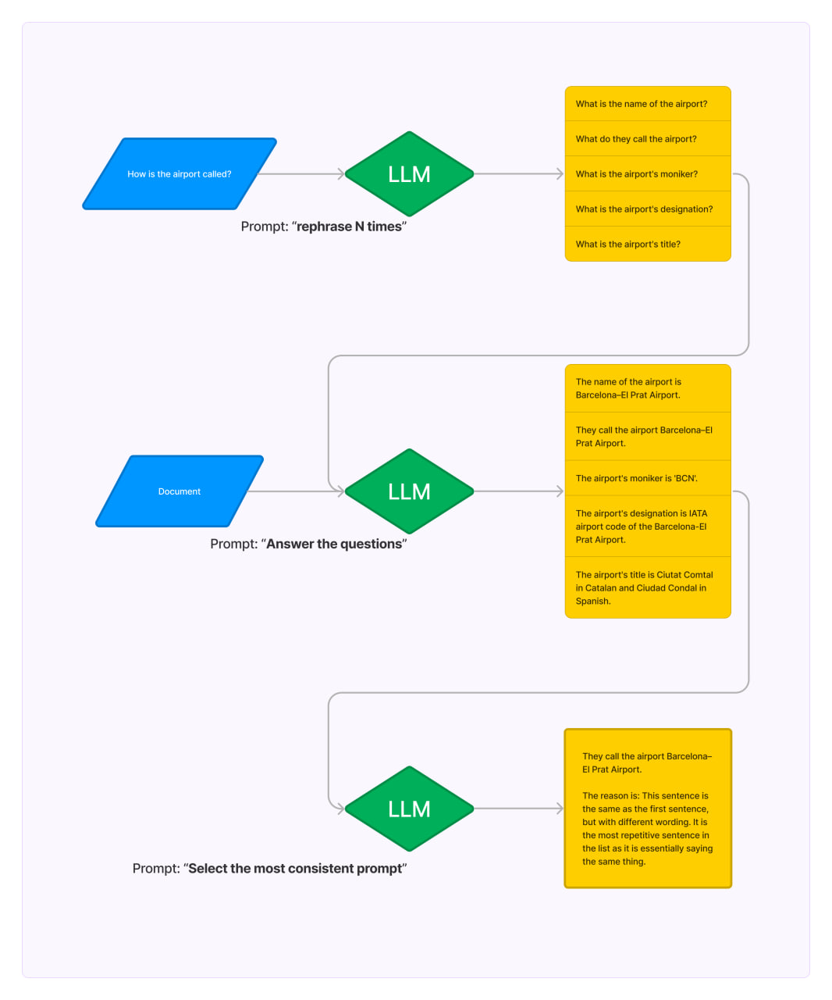

# Read document with Self-consistency

API key is from OpenAI: https://platform.openai.com/

To start:

```bash
# install dependencies
pip install streamlit
pip install requirements.txt

# launch
streamlit run streamlit_app.py
```
### Scheme:

